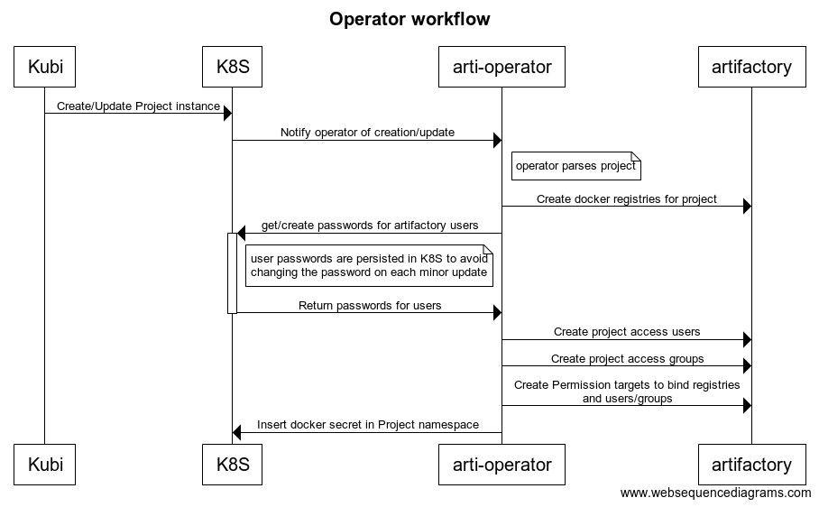
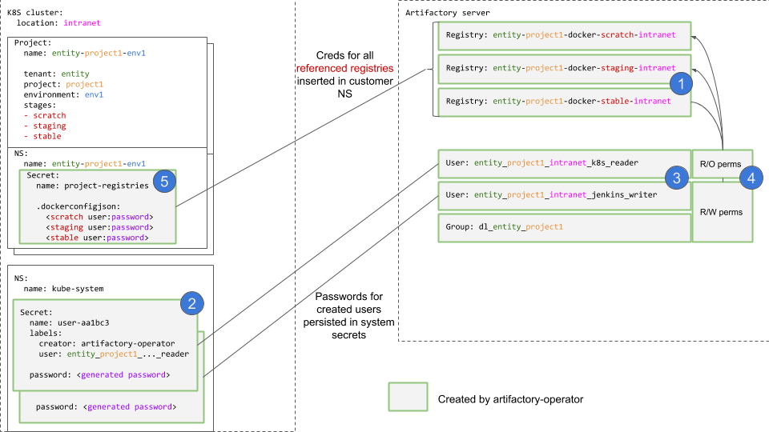
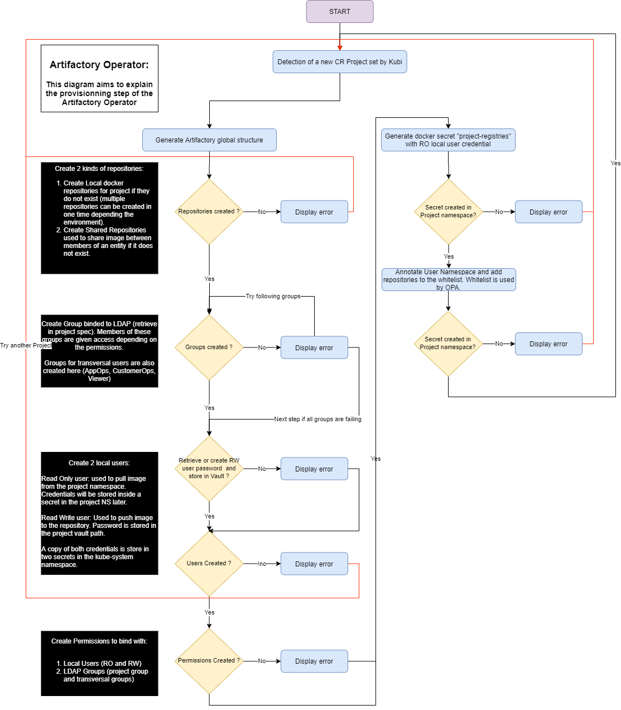

# Artifactory provisioning operator

Creates Artifactory Docker registries and the users to access them based on instances of the Project CRD of [Kubi](https://github.com/ca-gip/kubi).

In an `intranet` cluster, for the following Project resource :
```yaml
---
apiVersion: "cagip.github.com/v1"
kind: Project
metadata:
  name: sampleorg-project1-development
spec:
    tenant: sampleorg
    environment: development
    project: project1
    stages:
      - scratch
      - staging
      - stable
```

The operator will :
- Create Artifactory Docker registries for the three stages: `sampleorg-project1-docker-scratch-intranet`, etc.
- Create a `reader` and `writer` user in Artifactory with permissions on the above registries.
- Create a `dl_sampleorg_project1` group in Artifactory with RW rights on the above registries.
- Create a [Docker registry secret](https://kubernetes.io/docs/tasks/configure-pod-container/pull-image-private-registry/#create-a-secret-in-the-cluster-that-holds-your-authorization-token) named `project-registries` in the `sampleorg-projectA-development` namespace (same name as the project).

# Building and deploying

## Build Requirements
- Go 1.10 minimum (tested with v1.10.4).
- [Glide](https://github.com/Masterminds/glide).
- GNU Make.
- Docker to build the image.

## Runtime requirements
- Administrative access to a Kubernetes cluster with [Kubi](https://github.com/ca-gip/kubi) deployed and its Project CRD installed.
- Administrative access to an activated Artifactory Pro installation, with a well-configured [reverse-proxy for Docker Subdomains](https://www.jfrog.com/confluence/display/RTF/Configuring+a+Reverse+Proxy#ConfiguringaReverseProxy-UsingSubdomain).

## Building locally

```bash
make dep
make build
```
The output binary will be called `build/artifactory-operator`.

## Versioning

Since version v1.24.0, we have decided to modify the naming of versions for ease of reading and understanding.

Example: v1.24.0 means that the operator was developed for Kubernetes version 1.24 and that the last 0 corresponds to the various patches we have made to the operator.


## Testing locally
After building, edit `tests/operator-env.inc.sh` and set valid values for your environment (see below for configuration settings). The operator will use the current context of your `.kube/config` file to connect to the K8S cluster.

Then :
```bash
source tests/operator-env.inc.sh
build/artifactory-operator
```

## Building the Docker image
Edit the `DOCKER_REPO` variable in `Makefile` to target a Docker registry where you can push the image, then:
```bash
make image
```

## Deploying to Kubernetes
Edit `deployment/01 - artifactory-operator-config.yaml` and `deployment/02 - artifactory-operator-secret.yaml` to adapt the configuration (see below for options).
Edit `deployment/03 - artifactory-operator.yaml` to pull the image from your own Docker registry.

Then :
```bash
kubectl apply -f deployment/*
```

# Configuration

`artifactory-operator` expects configuration through environment variables. They can be set in K8S ConfigMaps or secrets, see the manifests ion the `deployment/` directory.

| Name                            | Description                          | Example                       | Mandatory | Default      |
| :--------------                 | :-----------------------------:      | ----------------------------: | ---------:| ----------:  |
|  **ARTI_OP_ARTIFACTORY_SERVER_URL**       |  *Artifactory server URL*           | `https://artifactory.example.com`      | `yes`     | -           |
|  **ARTI_OP_ARTIFACTORY_SERVER_USER**              |  *Name of an Artifactory admin user*       | `admin` | `yes`     | -           |
|  **ARTI_OP_CLUSTER_LOCATION**        |  *K8S cluster location ('intranet' or 'extranet')*      | `intranet`  | `yes`     | -           |
|  **ARTI_OP_CLUSTER_DNSSUBDOMAIN**        |  *K8S cluster location ('intranet' or 'extranet')*      | `devopshp`  | `yes`  | -           |
|  **ARTI_OP_PASSWORDSTORE_BACKEND_NAMESPACE**       |  *K8S namespace wher the operator will persist passwords generated for Artifactory users*| `kube-system`| `no`     | `kube-system`           |
|  **ARTI_OP_PASSWORDSTORE_SECRET_NAME_PREFIX**                |  *Prefix added to the names of password secrets*            | `artifactory-user` | `yes  `     | `artifactory-user`           |
|  **ARTI_OP_VAULT_SERVER_URL**        | *URL Vault* | `yes` | - |
|  **ARTI_OP_VAULT_TOKEN**        | *Token Vault* | `yes` | - |
|  **ARTI_OP_ARTIFACTORY_SERVER_TOKEN** | *Artifactory Token for ARTI_OP_ARTIFACTORY_SERVER_USER* | `yes` | - |
|  **LDAP_APP_OPS_GROUPBASE** | *CN=TRIPTYQUE_ALL,OU=FACTORY_DEVOPS,OU=Applications,OU=Groupes,O=CA* | `yes` | - |
|  **LDAP_CUSTOMER_OPS_GROUPBASE** |  | `yes` | - |
|  **SHARED_REPOSITORY** | *Activate shared repository feature* | `yes` | - |

## V2 Configuration

Version 2 of the operator adds support for making direct calls to an external API when processing Project CRDs. This functionality is controlled by the following environment variables:

| Name                            | Description                          | Example                       | Mandatory | Default      |
| :--------------                 | :-----------------------------:      | ----------------------------: | ---------:| ----------:  |
|  **ARTI_OP_ENABLE_V2**          |  *Enable v2 functionality with external API integration* | `true` | `no`     | `false`     |
|  **ARTI_OP_EXTERNAL_API_ENDPOINT** | *The URL for the external API* | `https://api-automation.cagip.gca.com/createorupdateapp` | `no` | `https://api-automation.cagip.gca.com/createorupdateapp` |
|  **ARTI_OP_EXTERNAL_API_ENABLED** | *Enable or disable external API calls* | `true` | `no` | `true` |
|  **ARTI_OP_EXTERNAL_API_TOKEN** | *Authentication token for the external API* | `dsfqlfn,qpfn,mf,fqfqd` | `yes` (if v2 enabled) | - |

The external API token should be stored in the Secret and referenced in the Deployment as shown in the example manifests.

## How V2 Works

When v2 is enabled, the operator will:

1. Check if a Project resource is v2 based on its API version
2. For v2 Projects, it will:
   - Validate that the Project has the required fields (tenant and project)
   - Make a call to the external API with the tenant and project values
   - Continue with the normal Artifactory operations for backward compatibility

For v1 Projects, the operator will continue to work as before, with no changes to the existing functionality.

### Example V2 Project Resource

Here's an example of a v2 Project resource:

```yaml
---
apiVersion: v1
kind: Namespace
metadata:
  name: cats-secu-development
---
apiVersion: "cagip.github.com/v2"
kind: Project
metadata:
  name: cats-secu-development
spec:
    tenant: cats
    environment: development
    project: secu
```

Note that for v2 Projects, only the `tenant` and `project` fields are required. The `environment` field is optional but recommended for consistency with v1 Projects.

A test file with this example is available at `tests/project-test-resource-v2.yaml`.

# Required permissions

## On Kubernetes
The operator needs the rights to:
- *Read* and *watch* the Project resource of Kubi: to trigger the operator.
- *Read* and *Write* Secrets to any namespace:
  - to deploy [Docker registry secrets](https://kubernetes.io/docs/tasks/configure-pod-container/pull-image-private-registry/#create-a-secret-in-the-cluster-that-holds-your-authorization-token) to the namespaces associated with the Projects.
  - To persist the generated Artifactory passwords in the `kube-system` namespace (or the one specified in `ARTI_OP_PASSWORDSTORE_BACKEND_NAMESPACE`) as opaque Secrets.

Those rights are modelized in the `artifactory-operator-role` ClusterRole in `deployment/03 - artifactory-operator.yaml".

## On Artifactory
The operator needs the rights to:
- Create Docker repositories.
- Create and update users.
- Create and update groups.
- Create and update Permission Targets.

# Architecture

## Workflow

General workflow of the operator:


## Mapping of K8S and Artifactory resources



**Note:** An instance of a Kubi Project corresponds conceptually to a *project environment*, one K8S Namespace. Kubi Projects which share `entity` and `project` values will target the *same Artifactory users and registries*.

## Limitations

### Multiple clusters with the same projects : passwords on one of the cluster will be incorrect

If multiple K8S clusters host the same project, from the same entity, one of the clusters will have **incorrect passwords** for the Artifactory users.

Scenario that causes this:
- First cluster reacts to new project `entityA-projectTOTO-...`
  - It creates new Artifactory users `entity1_projectTOTO_k8s_reader` and `_jenkins_writer`.
  - It persists their passwords in the K8S cluster, **locally**.
- Second cluster reacts to new project `entityA-projectTOTO-...`
  - It doesn't find the passwords for the users locally (they are in the **other cluster**), so creates and stores new ones.
  - It updates the Artifactory users with the new passwords.
- The first cluster does not know this, and now has invalid passwords.

**Possible solutions**

- Store passwords globally, for example in a **single** Vault folder, the same for every K8S cluster of CAGIP.
- Refactor Artifactory users : find a scheme that avoids sharing usernames between clusters. 
- Stop generating passwords with the operator : some LDAP-based solution ?
- See what [Arti auth tokens](https://gitlab.com/emmanuel.fortin/artifactory-operator/tree/services_artifactory) can do ?

## TODO

- Better parsing and validation of configuration : use https://github.com/go-ozzo/ozzo-validation
- Implement integration tests or mocked tests for the code that queries Artifactory and K8S.
- Add some retry on operations at several levels to handle temporary errors:
  - Maybe retry the whole event handling itself.
  - Retry the dockerconfigsecret creation, might fail if the customer Namespace isn't created quickly enough.
  - Retry Artifactory operations if Artifactory is unavailable.

### Flowchart diagram

